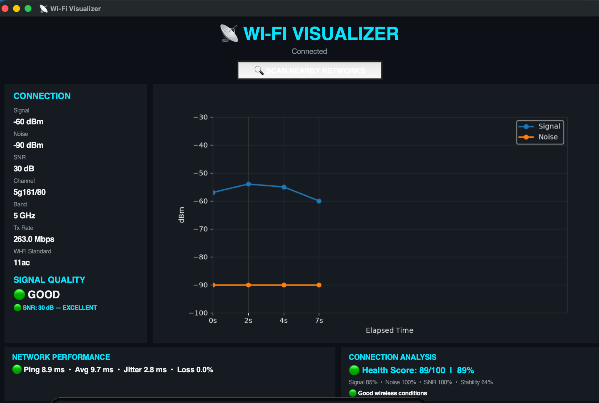

# 📡 Wi-Fi Visualizer

A real-time Wi-Fi monitoring and wireless environment analysis dashboard for macOS.



## ✨ Features

- 📶 Live Wi-Fi signal (RSSI) monitoring
- 📡 Noise level monitoring
- 📊 Signal-to-Noise Ratio (SNR)
- 📈 Real-time signal and noise graph
- 💚 Connection health score
- 📉 Signal stability analysis
- ⚡ Ping, average latency and jitter monitoring
- 📦 Packet-loss monitoring
- 🔍 Nearby Wi-Fi network scanner
- 📡 Wi-Fi channel and band detection
- 💡 Wireless environment/channel analysis

## 🖥️ Dashboard

The dashboard provides a live overview of the current Wi-Fi connection, including signal strength, noise, SNR, channel, frequency band, transmit rate, Wi-Fi standard, latency and connection health.

## 🛠️ Requirements

- macOS
- Python 3
- Tkinter
- Matplotlib
- Wi-Fi interface supported by macOS `wdutil`

## 🚀 Running the project

Clone the repository:

```bash
git clone https://github.com/YOUR_USERNAME/wifi-visualizer.git
cd wifi-visualizer
```

Install the Python dependency:

```bash
python3 -m pip install matplotlib
```

Because macOS Wi-Fi information requires elevated access, start the dashboard with:

```bash
sudo -v
python3 dashboard.py
```

## 📊 Example Metrics

The dashboard can display values such as:

| Metric | Example |
|---|---:|
| Signal | -60 dBm |
| Noise | -90 dBm |
| SNR | 30 dB |
| Band | 5 GHz |
| Channel | 5g161/80 |
| Tx Rate | 263 Mbps |
| Ping | 8.9 ms |
| Packet Loss | 0.0% |
| Health Score | 89% |

## 📁 Project Structure

```text
wifi-visualizer/
├── dashboard.py
├── screenshots/
│   └── dashboard.png
└── README.md
```

## ⚠️ macOS note

The application uses macOS wireless information provided by `wdutil`. Some Wi-Fi information may require administrator privileges.

## 👨‍💻 Project

Built as a personal engineering project to visualize wireless-network conditions in real time.
